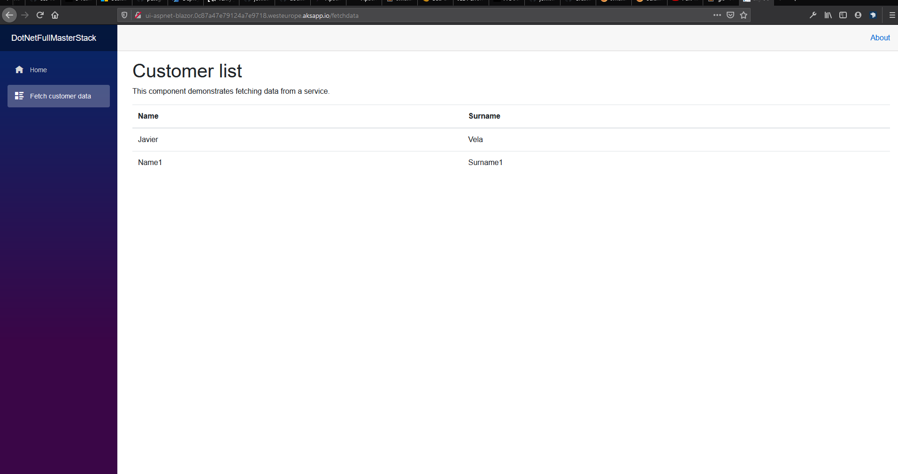
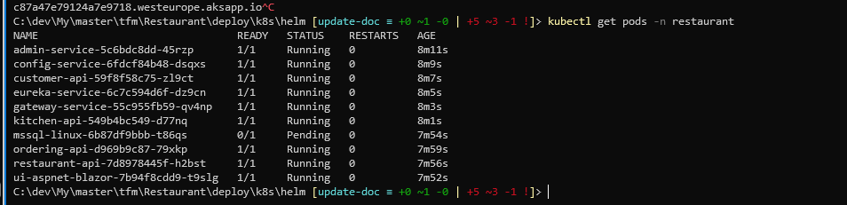

# AKS
Azure Kubernetes Service (AKS) facilita el despliegue de un clúster kubernetes como servicio en la nube de Azure reduciendo la complejidad de su administración y facilitando las tareas de mantenimiento. 

## Herramientas necesarias
1. .NET Core 3.1 https://dotnet.microsoft.com/download
2. Azure CLI  https://docs.microsoft.com/en-us/cli/azure/install-azure-cli
3. Helm 3 https://github.com/helm/helm/releases
4. Docker desktop https://www.docker.com/products/docker-desktop
5. Visual code or visual studio 2019
    - https://code.visualstudio.com/download
    - https://visualstudio.microsoft.com/vs/community/ 
6. PowerShell

## Despliegue con Azure CLI
1. Crear grupo recursos:
    ```
    az group create --name dotnetfullmasterstack --location westeurope
    ```
2. Ejecutar (deploy/az/):
    ```
    ./createresources.sh aks/aks dotnetfullmasterstack -c westeurope
    ```
3. Conectar al clúster AKS
    - az account set --subscription YOUR_SUBSCRIPTION_ID
    - az aks get-credentials --resource-group dotnetfullmasterstack --name DotNetFullMasterStack
3. Consultar DNS creada
    ```
    az network dns zone list
    ```
4. Crear namespace para el despliegue de la app
    ```
    create ns restaurant
    ````
5. Desplegar la aplicación
    ```
    .\deploy-all.ps1 -appName restaurant -domain 0c87a47e79124a7e9718.westeurope.aksapp.io
    ```
6. Abrir aplicación: ui-aspnet-blazor.0c87a47e79124a7e9718.westeurope.aksapp.io





[](https://portal.azure.com/#create/Microsoft.Template/uri/https%3A%2F%2Fraw.githubusercontent.com%2FMasterCloudApps-Projects%2FDotNetFullMasterStack%2Fmaster%2Fdeploy%2Faz%2Faks%2Faks.json)
