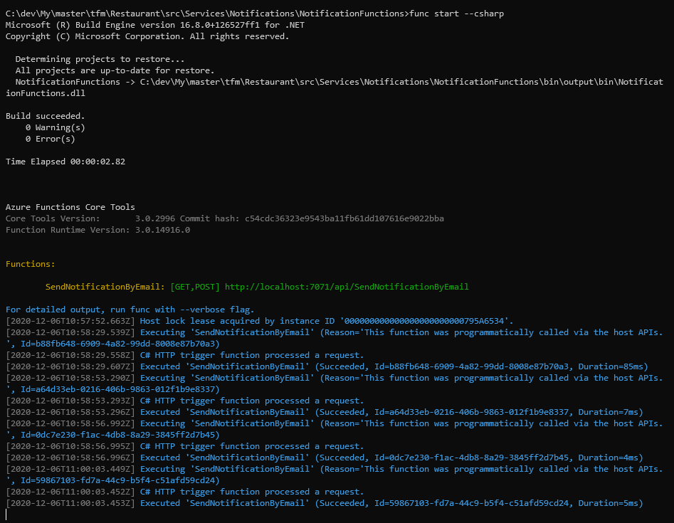

# Azure functions
[Azure functions](https://azure.microsoft.com/en-us/services/functions) permite ejecutar código .net, node, java, power shell o phyton a partir de un evento: Blob storage, Azure cosmos DB, Http, RabbitMQ o Azure queue storage sin necesidad de tener un servidor.

Con Azure Functions podemos cubrir diferentes escenarios tales como procesar archivos cuando se almacenan, ejecutar tareas programadas, analizar datos o procesar información sin necesidad de tener un proceso arrancado consumiendo diferentes recursos.

## Herramientas necesarias
Azure Functions Core Tools https://docs.microsoft.com/en-us/azure/azure-functions/functions-run-local

## Ejecucion
Ejecución desde consola (desde src/Services/Notifications/NotificationFunctions/)
  ```
  func start --csharp
  ```
Para ejecutar la función es necesario realizar una llamada GET a la URL http://localhost:7071/api/SendNotificationByEmail?name=Javier 

